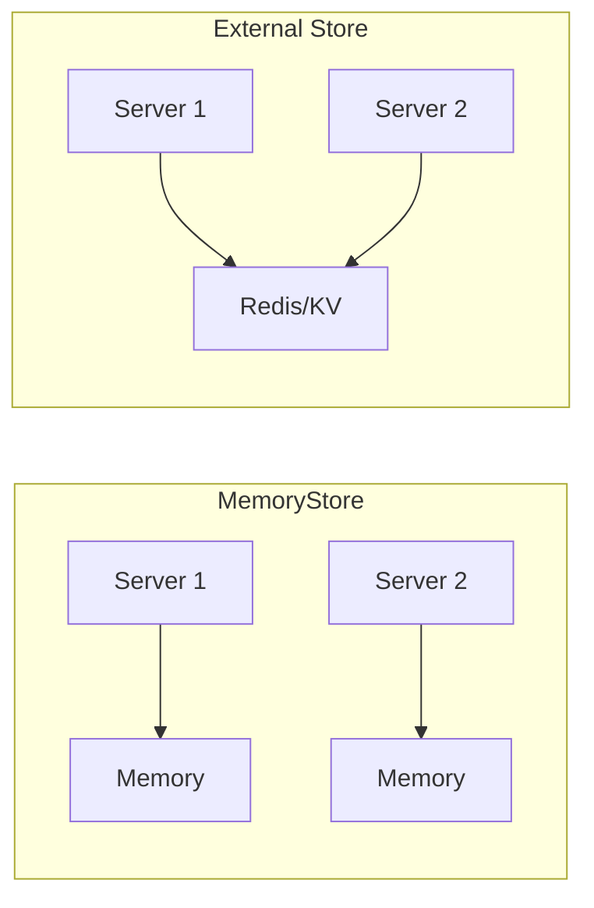

Data stores are used by `hono-rate-limiter` to track the number of requests each client has made within a time window. The choice of store affects how rate limiting behaves in different deployment scenarios.

## Why Use External Stores?

By default, `hono-rate-limiter` uses an in-memory store (`MemoryStore`). While simple to set up, it has limitations:

- **No state sharing**: Each process/server maintains its own count
- **State loss on restart**: All rate limit data is lost when the process restarts
- **Inconsistent limits**: In multi-server deployments, clients can exceed limits

For production deployments, especially with multiple servers or serverless functions, use an external store like Redis or Cloudflare KV.



## Available Stores

| Store | Best For | Import |
|-------|----------|--------|
| [MemoryStore](#memorystore) | Development, single-process apps | Built-in (default) |
| [RedisStore](/docs/rate-limiter/stores/redis) | Multi-server deployments | `import { RedisStore } from "hono-rate-limiter"` |
| [WorkersKVStore](/docs/rate-limiter/stores/cloudflare) | Cloudflare Workers | `import { WorkersKVStore } from "hono-rate-limiter"` |
| [DurableObjectStore](/docs/rate-limiter/stores/cloudflare) | Cloudflare Workers (precise) | `import { DurableObjectStore } from "hono-rate-limiter"` |
| [UnstorageStore](/docs/rate-limiter/stores/unstorage) | Universal (any backend) | `import { UnstorageStore } from "hono-rate-limiter"` |

## MemoryStore

The default store that keeps hit counts in memory. Suitable for development and single-process applications.

```ts
import { rateLimiter } from "hono-rate-limiter";

app.use(
  rateLimiter({
    windowMs: 60_000,
    limit: 100,
    keyGenerator: (c) => c.req.header("x-forwarded-for") ?? "",
    // MemoryStore is used by default
  })
);
```

### Characteristics

- Zero configuration required
- Fast (no network calls)
- Does not share state across processes
- State is lost on restart
- Suitable for development and single-instance deployments

### How It Works

The `MemoryStore` uses two internal maps to efficiently track clients:

1. **Current window**: Active clients making requests
2. **Previous window**: Clients from the last window (for cleanup)

When a window expires, clients in the "previous" map are cleared, and "current" becomes "previous". This approach allows efficient memory management without iterating through all keys.

## Community-Compatible Stores

Since `hono-rate-limiter` follows a similar store interface to `express-rate-limit`, many community stores are compatible:

| Store | Backend | Package |
|-------|---------|---------|
| rate-limit-redis | Redis (ioredis) | [npm](https://npm.im/rate-limit-redis) |
| rate-limit-postgresql | PostgreSQL | [npm](https://npm.im/@acpr/rate-limit-postgresql) |
| rate-limit-memcached | Memcached | [npm](https://npm.im/rate-limit-memcached) |
| typeorm-rate-limit-store | TypeORM (multiple DBs) | [npm](https://npm.im/typeorm-rate-limit-store) |
| cluster-memory-store | Node.js Cluster | [npm](https://npm.im/@express-rate-limit/cluster-memory-store) |

<Callout type="warn" title="Type Compatibility">
When using third-party stores, you may need to cast them to work with TypeScript. See [Troubleshooting](/docs/rate-limiter/troubleshooting#typescript-type-issues) for details.
</Callout>

## Creating a Custom Store

You can create your own store by implementing the `Store` interface:

```ts
import type { Store, ClientRateLimitInfo, HonoConfigType } from "hono-rate-limiter";

class MyCustomStore implements Store {
  windowMs: number = 0;

  init(options: HonoConfigType) {
    this.windowMs = options.windowMs;
  }

  async get(key: string): Promise<ClientRateLimitInfo | undefined> {
    // Fetch hit count and reset time for the key
  }

  async increment(key: string): Promise<ClientRateLimitInfo> {
    // Increment hit count and return updated info
    return { totalHits: 1, resetTime: new Date(Date.now() + this.windowMs) };
  }

  async decrement(key: string): Promise<void> {
    // Decrement hit count
  }

  async resetKey(key: string): Promise<void> {
    // Reset hit count for the key
  }

  async resetAll(): Promise<void> {
    // Reset all keys (optional)
  }

  async shutdown(): Promise<void> {
    // Cleanup resources (optional)
  }
}
```

### Store Interface

| Method | Required | Description |
|--------|----------|-------------|
| `init(options)` | No | Called when the middleware is initialized |
| `get(key)` | No | Fetch current hit count and reset time |
| `increment(key)` | Yes | Increment hit count, return updated info |
| `decrement(key)` | Yes | Decrement hit count |
| `resetKey(key)` | Yes | Reset hit count for a specific key |
| `resetAll()` | No | Reset all keys |
| `shutdown()` | No | Cleanup resources (timers, connections) |

### ClientRateLimitInfo

The `increment` and `get` methods should return an object with:

```ts
type ClientRateLimitInfo = {
  totalHits: number;      // Current number of hits
  resetTime?: Date;       // When the window resets
};
```

