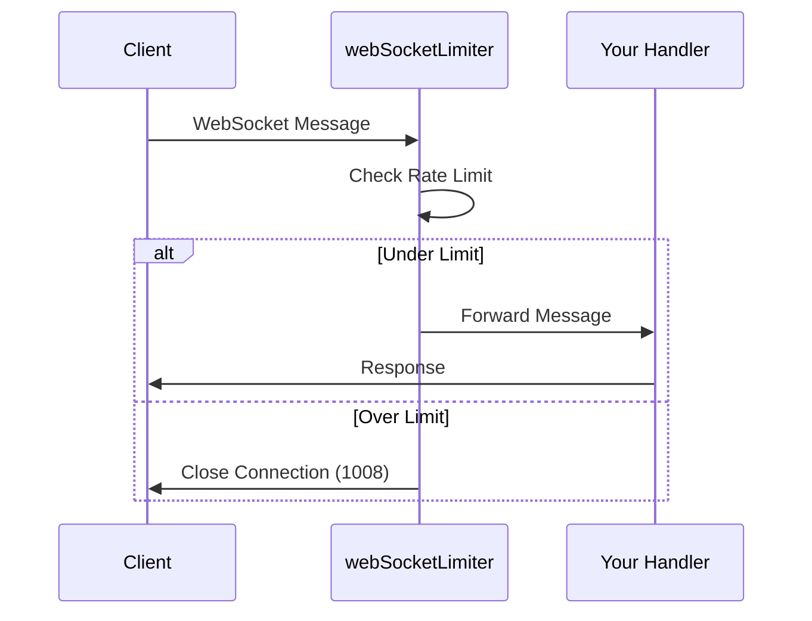

`hono-rate-limiter` provides built-in support for rate limiting WebSocket connections through the `webSocketLimiter` function. This allows you to limit the number of messages a client can send within a time window.

## Basic Usage

```ts
import { Hono } from "hono";
import { upgradeWebSocket } from "hono/cloudflare-workers"; // or your adapter
import { webSocketLimiter } from "hono-rate-limiter";

const app = new Hono();

const limiter = webSocketLimiter({
  windowMs: 60 * 1000, // 1 minute
  limit: 100, // 100 messages per minute
  keyGenerator: (c) => c.req.header("x-forwarded-for") ?? "",
});

app.get(
  "/ws",
  upgradeWebSocket(
    limiter((c) => ({
      onOpen: () => {
        console.log("Connection opened");
      },
      onMessage: (event, ws) => {
        console.log(`Message: ${event.data}`);
        ws.send("Hello from server!");
      },
      onClose: () => {
        console.log("Connection closed");
      },
    }))
  )
);

export default app;
```

## How It Works

The `webSocketLimiter` wraps your WebSocket event handlers and intercepts the `onMessage` event. Each message received from the client increments the hit counter. When the limit is exceeded, the connection is closed with a status code and message.



## Configuration Options

The `webSocketLimiter` accepts most of the same options as `rateLimiter`, with some WebSocket-specific differences:

### Core Options

| Option | Type | Default | Description |
|--------|------|---------|-------------|
| `windowMs` | number | 60000 | Time window in milliseconds |
| `limit` | number/function | 5 | Max messages per window |
| `keyGenerator` | function | required | Unique client identifier |
| `message` | string | "Too many requests..." | Message sent on close |
| `statusCode` | WSStatusCode | 1008 | WebSocket close code |

### WebSocket Status Codes

The `statusCode` option uses WebSocket close codes instead of HTTP status codes:

| Code | Name | Description |
|------|------|-------------|
| 1000 | Normal Closure | Normal connection close |
| 1008 | Policy Violation | Used for rate limit exceeded (default) |
| 1009 | Message Too Big | Message exceeds size limit |

### Custom Handler

```ts
webSocketLimiter({
  windowMs: 60_000,
  limit: 100,
  keyGenerator: (c) => c.req.header("x-forwarded-for") ?? "",
  handler: (event, ws, options) => {
    // Send a message before closing
    ws.send(JSON.stringify({ error: "Rate limit exceeded" }));
    // Close with custom code and reason
    ws.close(1008, "Too many messages");
  },
});
```

### Skip Function

The `skip` function for WebSocket receives the message event and WebSocket context:

```ts
webSocketLimiter({
  windowMs: 60_000,
  limit: 100,
  keyGenerator: (c) => c.req.header("x-forwarded-for") ?? "",
  skip: (event, ws) => {
    // Skip rate limiting for ping messages
    return event.data === "ping";
  },
});
```

## Using with External Stores

For production deployments, use an external store to share rate limit state across connections:

```ts
import { upgradeWebSocket } from "hono/cloudflare-workers";
import { webSocketLimiter, RedisStore } from "hono-rate-limiter";
import { Redis } from "@upstash/redis";

const redis = new Redis({
  url: process.env.UPSTASH_REDIS_REST_URL,
  token: process.env.UPSTASH_REDIS_REST_TOKEN,
});

const limiter = webSocketLimiter({
  windowMs: 60 * 1000,
  limit: 100,
  keyGenerator: (c) => c.req.header("x-forwarded-for") ?? "",
  store: new RedisStore({ client: redis }),
});

app.get(
  "/ws",
  upgradeWebSocket(
    limiter((c) => ({
      onMessage: (event, ws) => {
        ws.send(`Echo: ${event.data}`);
      },
    }))
  )
);
```

## Platform-Specific Adapters

The `upgradeWebSocket` helper comes from your platform-specific adapter:

```ts
// Cloudflare Workers
import { upgradeWebSocket } from "hono/cloudflare-workers";

// Deno
import { upgradeWebSocket } from "hono/deno";

// Bun
import { upgradeWebSocket } from "hono/bun";

// Node.js (requires @hono/node-ws)
import { createNodeWebSocket } from "@hono/node-ws";
const { upgradeWebSocket } = createNodeWebSocket({ app });
```

## Complete Example

```ts
import { Hono } from "hono";
import { upgradeWebSocket } from "hono/cloudflare-workers";
import { webSocketLimiter, RedisStore } from "hono-rate-limiter";

const app = new Hono();

const wsLimiter = webSocketLimiter({
  windowMs: 60 * 1000, // 1 minute
  limit: 100, // 100 messages per minute
  keyGenerator: (c) => c.req.header("cf-connecting-ip") ?? "",
  message: "Message rate limit exceeded",
  statusCode: 1008,
  store: new RedisStore({ client: redis }),
  skip: (event) => {
    // Don't count heartbeat messages
    return event.data === "heartbeat";
  },
  handler: (event, ws, options) => {
    ws.send(JSON.stringify({
      type: "error",
      message: options.message,
    }));
    ws.close(options.statusCode, options.message);
  },
});

app.get(
  "/chat",
  upgradeWebSocket(
    wsLimiter((c) => ({
      onOpen: (event, ws) => {
        ws.send(JSON.stringify({ type: "connected" }));
      },
      onMessage: (event, ws) => {
        const message = JSON.parse(event.data as string);
        // Handle chat message
        ws.send(JSON.stringify({ type: "received", data: message }));
      },
      onClose: () => {
        console.log("Client disconnected");
      },
      onError: (event, ws) => {
        console.error("WebSocket error:", event);
      },
    }))
  )
);

export default app;
```

